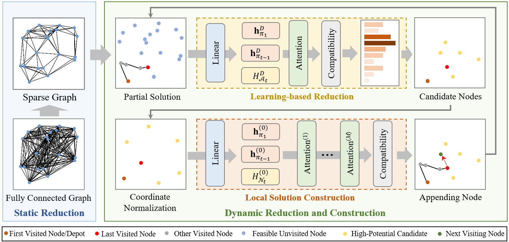

## [SIGKDD 2026] Learning to Reduce Search Space for Generalizable Neural Routing Solver

This repository contains the code implementation of the paper [**Learning to Reduce Search Space for Generalizable Neural Routing Solver**](https://arxiv.org/pdf/2503.03137). In this paper, we propose a powerful RL-based constructive neural routing solver called L2R. L2R is the first learning-based dynamic Search Space Reduction (SSR) framework designed to scale constructive Neural Combinatorial Optimization (NCO) to large-scale Vehicle Routing Problems (VRPs). By extracting patterns from problem-specific features, L2R adaptively prioritizes nodes to dynamically prune the search space at each construction step, effectively overcoming the limitations of traditional distance-based reduction methods.



## ✨ Key Features

* **Unprecedented Scalability:** L2R is the first purely learning-based neural solver capable of scaling effectively to routing instances with up to **10 million nodes**.
* **Robust Generalization:** Trained exclusively on 100-node uniform instances, the model robustly generalizes across varying scales, distinct data distributions (cluster, explosion, implosion), and real-world benchmark datasets (TSPLIB, CVRPLIB Set-XXL, DIMACS).
* **Handles Complex Constraints:** Effectively solves diverse NCO applications, including TSP, CVRP, and CVRPTW, by capturing complex non-spatial constraints (like capacity and time windows) that simple geometric pruning ignores.

## 🏗️ Framework Overview

The L2R framework operates through a highly efficient three-stage pipeline:

1.  **Static Reduction:** A one-time preprocessing step that safely prunes clearly unpromising long-range edges (i.e., the farthest 10%) based on distance priors, reducing initial memory overhead without sacrificing optimality.
2.  **Learning-based Reduction:** A lightweight architecture (embedding + attention layer) that dynamically evaluates the potential of all feasible nodes at each step, selecting only the top-k high-potential candidates based on learned spatial and non-spatial features.
3.  **Local Solution Construction:** A powerful multi-layer attention model that makes the final optimal node selection from the heavily reduced candidate set, enabling rapid and accurate routing decisions.

Both the reduction and local construction models are co-adapted and trained end-to-end using the REINFORCE algorithm, **eliminating the need for expensive labeled data.**

## 🚀 Getting Started

### Dependencies
The code is pure Python and PyTorch. A CUDA-enabled GPU is recommended for training and evaluation. We don't use any hard-to-install packages. If any package is missing, just install it following the prompts.

```text
Python >= 3.8.0
PyTorch >= 2.0.1
numpy
tqdm
```

### How to Run

Note: The project's structure is clear, with code based on .py files that should be easy to read, understand, and run.

The code for each CO problem defaults to retaining the parameters used for training the pre-trained model and those used for testing. Please refer to our paper for training and testing settings.

To run the code and further verify the efficiency of our method, please follow these steps:

#### 1. Clone the Repository
```bash
git clone https://github.com/CIAM-Group/L2R.git
cd L2R
```

#### 2. Install Dependencies
We recommend creating a virtual environment first (e.g., using conda).

```bash
# Example using conda
conda create -n l2r python=3.8
conda activate l2r

# Install PyTorch (example for CUDA 11.7)
pip install torch==2.0.1 torchvision==0.15.2 torchaudio==2.0.2

# Install other dependencies
pip install numpy==1.24.4
pip install tqdm
```

#### 3. Train the Model
L2R is trained with REINFORCE. Random TSP/CVRP instances are generated in `problem/ProblemDef.py`.
```bash
# Train TSP
python train.py --problem tsp --problem_size 100 --lower_neighbors_num 20 --train_batch_size 180 --eval_type sampling

# Train CVRP
python train.py --problem cvrp --problem_size 100 --lower_neighbors_num 50 --train_batch_size 60 --eval_type sampling
```
Training logs and checkpoints are saved under `result_train/`.

#### 4. Inference
You can use our provided pre-trained models or your own trained models to run the evaluation script and verify the method's performance. 

Our pre-trained models are placed at `./pretrained/tsp_best.pt` and `./pretrained/cvrp_best.pt`. Evaluation cases are managed in `test_config.py`.

Data: Please download test sets from [Google Drive](https://drive.google.com/drive/folders/1Owq6WzBciMTx8Dab4B2aeSdcXL-ZzLul?usp=sharing), and place them in `./dataset`. 

```bash
python test.py
```
To change test data, model paths, problem sizes, or distributions, edit `test_config.py`. Test logs are saved under `result_test/`.

## 📊 Results Summary

L2R achieves highly competitive performance against both classical solvers (LKH3, HGS) and leading NCO baselines (LEHD, INVIT, BQ) across the board. 

| Problem | Scale | L2R (Greedy) Gap | Inference Time | Notable Milestone |
| :--- | :--- | :--- | :--- | :--- |
| **TSP** | 100K | 4.79% | ~29 mins | Highly scalable without OOM issues. |
| **TSP** | 10M | 5.04% | 96 hrs | First neural solver to solve 10M nodes. |
| **CVRP** | 100K | -1.55% (vs HGS) | ~32 mins | Surpasses HGS with ~180x speedup. |
| **CVRPTW** | 10K | 8.83% | ~1.4mins | Adapts perfectly to time windows. |

*For full experimental details, cross-distribution analyses, and ablation studies, please refer to Section 4 of the paper.*

### Further Improvement
We have verified the legality of the corresponding solutions for each problem. We will continue to strive to improve its clarity and welcome any minor errors in the code implementation.

🐛 If there are any issues in running or re-implementing the code, please contact the author Changliang Zhou via email (zhoucl2022@mail.sustech.edu.cn) in a timely manner.


## Citation

🤩🤩🤩 **If this repository is helpful for your research, please cite our paper:<br />**

```
@inproceedings{zhou2026l2r,
  title={Learning to Reduce Search Space for Generalizable Neural Routing Solver},
  author={Zhou, Changliang and Lin, Xi and Wang, Zhenkun and Zhang, Qingfu},
  booktitle={32nd SIGKDD Conference on Knowledge Discovery and Data Mining},
  year={2026}
}
```

## Acknowledgements
Some implementations build on ideas and code from the following open-source projects. We sincerely appreciate their contributions to neural combinatorial optimization.

- ICAM: [https://github.com/CIAM-Group/ICAM](https://github.com/CIAM-Group/ICAM)
- AM: [https://github.com/wouterkool/attention-learn-to-route](https://github.com/wouterkool/attention-learn-to-route) 
- MVMoE: [https://github.com/RoyalSkye/Routing-MVMoE](https://github.com/RoyalSkye/Routing-MVMoE)


## Copyright (c) 2026 CIAM Group

**The code can only be used for non-commercial purposes. Please contact the authors if you want to use this code for business matters.**
